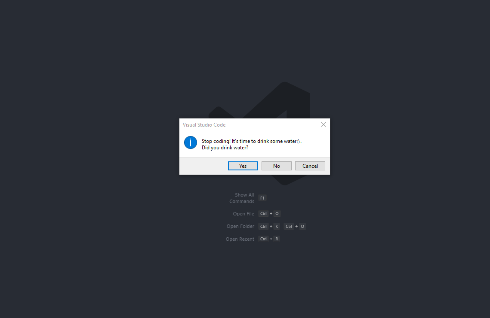
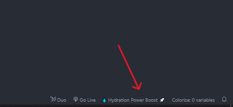
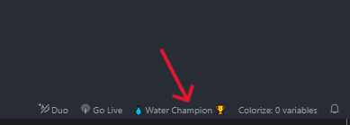
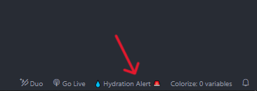
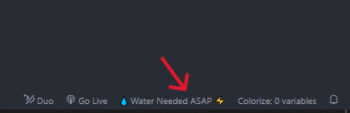

# 💧 WaterMyCode [](https://github.com/ellerbrock/open-source-badges/)

  
[](https://opensource.org/licenses/MIT)


**WaterMyCode** is a VSCode extension designed to help developers stay hydrated while coding! This extension reminds you to drink water at regular intervals, tracks your hydration level.

---

## 🌟 Features

- **Hydration Reminders**: Regular reminders to drink water while coding (You can't ignore it until giving it a response, sorry 😂).
 <br/>

- **Customizable Settings**: Set your preferred properties: drinking interval, body weight.
- **Hydration Tracking**: Tracks your hydration level throughout the day.
- **Status Bar Indicators**: Shows your hydration level directly on the status bar, with custom motivational messages.

<br/>

 <br/>
 <br/>
 <br/>
<br/>

- **Interactive Notifications**: A modal dialog to confirm whether you've hydrated.

---

## 🚀 Installation

1. **Install from VSCode Marketplace**:
   - Visit the [VSCode Marketplace](https://marketplace.visualstudio.com) and search for **WaterMyCode**.
   - Click "Install" to add the extension to your VSCode.
   
2. **Manual Installation**:
   - Download the latest release from the [Releases](https://github.com/mntcodes/watermycode/releases) page.
   - Open VSCode and navigate to `Extensions > Install from VSIX` and select the downloaded `.vsix` file.

---

## 🛠️ Usage

1. **Activate the Extension**:
   Once installed, WaterMyCode runs automatically when you open VSCode. You’ll start receiving hydration reminders at your configured intervals.

2. **Configure Your Preferences**:
   You can access the configuration settings by running the command:
   ```bash
   > WaterMyCode: Configure
   ```

3. **Hydration Status**:
   - The hydration status is visible in the bottom status bar.
   - Based on your input, the status will update as you hydrate throughout the day.

---

## 🔧 Configuration Options

- **Weight**: Set your weight to calculate the optimal water intake.
- **Reminder Interval**: Choose how often you’d like to be reminded.
  
---

## ▶️ Demo


---

## 🌱 Contribution

1. **Fork the repository**
2. **Create a new branch** (`git checkout -b feature/your-feature`)
3. **Commit your changes** (`git commit -m 'Add some feature'`)
4. **Push to the branch** (`git push origin feature/your-feature`)
5. **Open a pull request**

Contributions, issues, and feature requests are welcome!

---

## 📄 License

This project is licensed under the MIT License - see the [LICENSE](https://opensource.org/licenses/MIT) file for details.

---

## 💬 Contact

Feel free to reach out for any questions or suggestions!  

[About Me](https://mntcodes.com) <br/>
[Twitter](https://x.com/NaciriTaoufik) <br/>
[LinkedIn](https://www.linkedin.com/in/mednt/) <br/>
[GitHub](https://github.com/MedNT) <br/>
[Blog](https://mntcode.substack.com/) 
